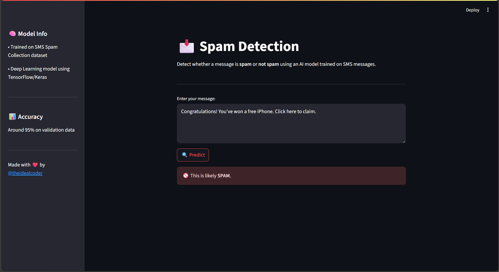
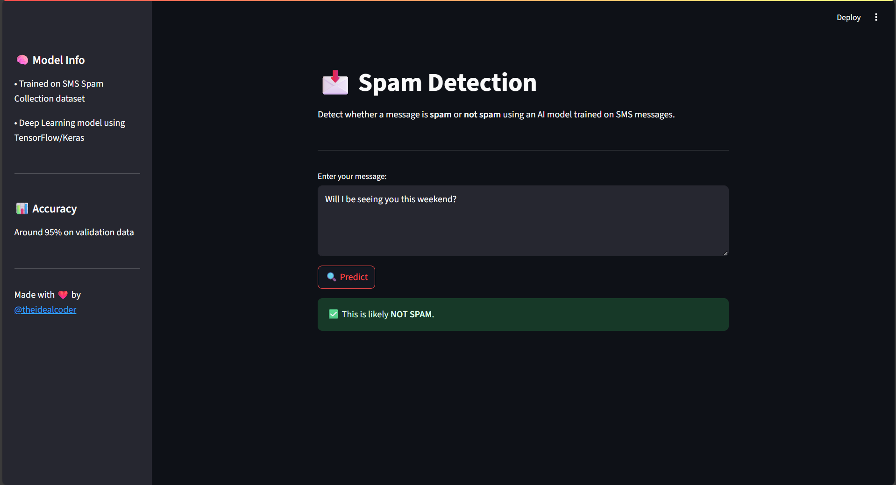

# 📩 Spam Message Detector (Streamlit + TensorFlow)

A simple spam detection web app built with Streamlit and a deep learning model trained on the SMS Spam Collection dataset.

## 🚀 Features
- Classifies messages as **spam** or **not spam**
- Clean and modern UI using Streamlit
- TensorFlow-based text classification model
- Real-time predictions

## 📸 Screenshots



<p align="center">Made  with  ❤️  by <a  href="https://instagram.com/theidealcoder">@theidealcoder</a></p>

## 🔧 Installation
```bash
git clone https://github.com/Parth-Udawant/Spam-SMS-Detection.git
cd Spam-SMS-Detection
pip install -r requirements.txt
streamlit run app.py